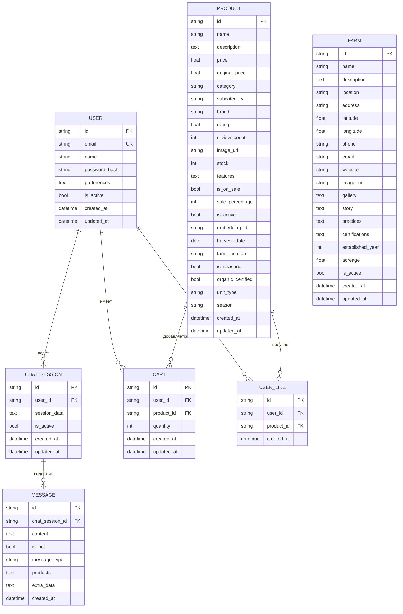
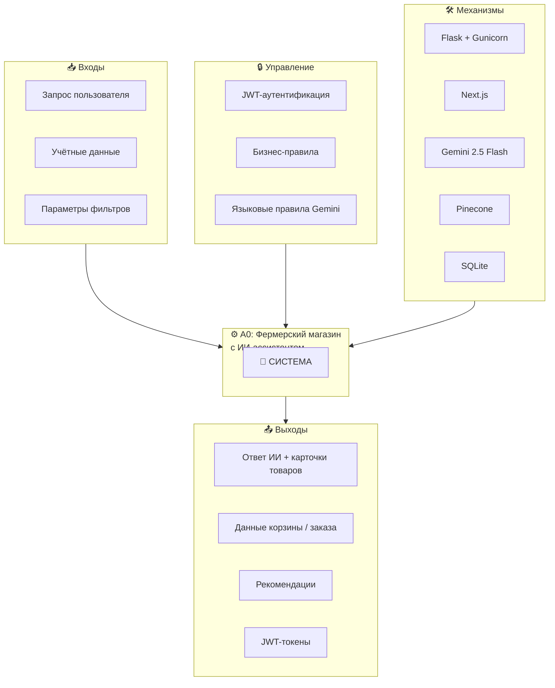
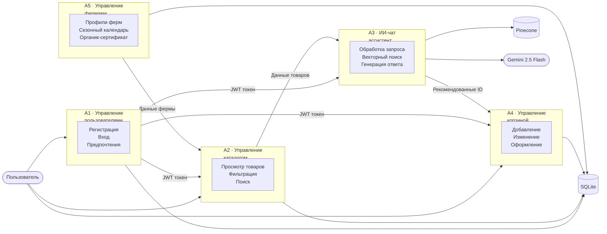
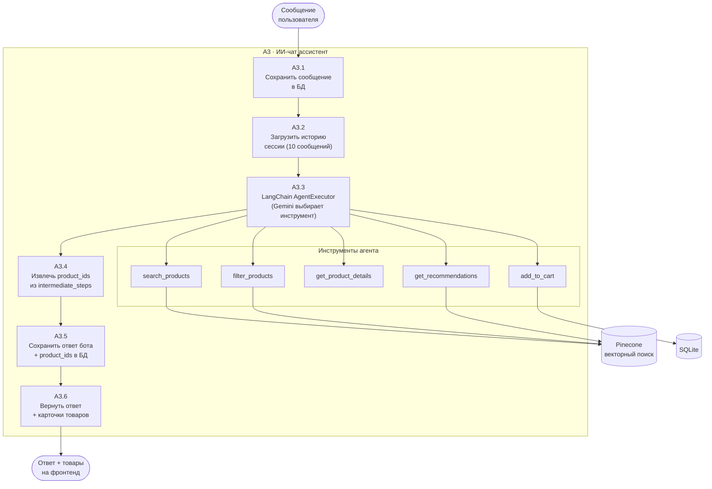
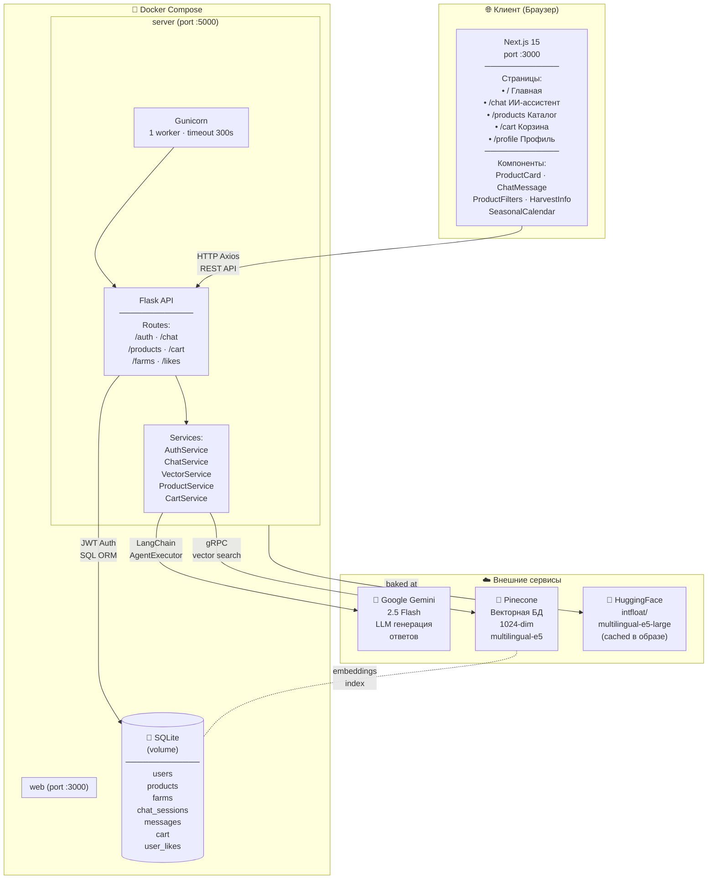
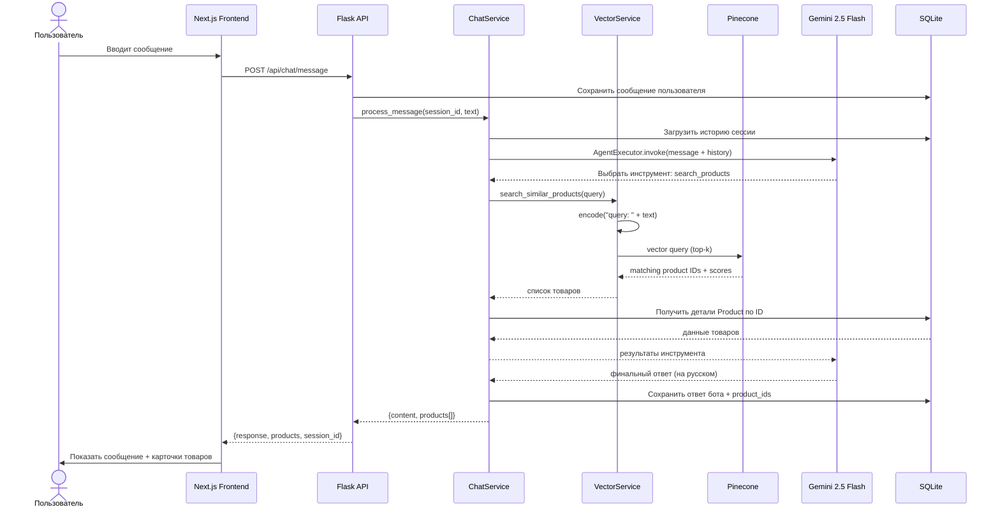

# Диаграммы проекта — Фермерский интернет-магазин с ИИ-ассистентом

---

## 1. ER-диаграмма (Entity-Relationship)

---

## 2. IDEF0-диаграмма (функциональная декомпозиция)

### Контекстная диаграмма A-0

### Декомпозиция A0 — уровень функций

### Декомпозиция A3 — ИИ-чат (детально)

---

## 3. Архитектурная диаграмма

### Диаграмма потока данных при чат-запросе

